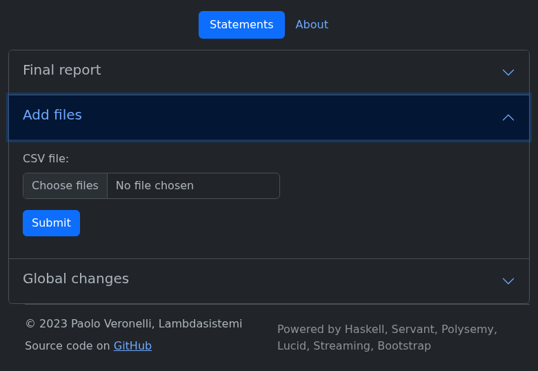
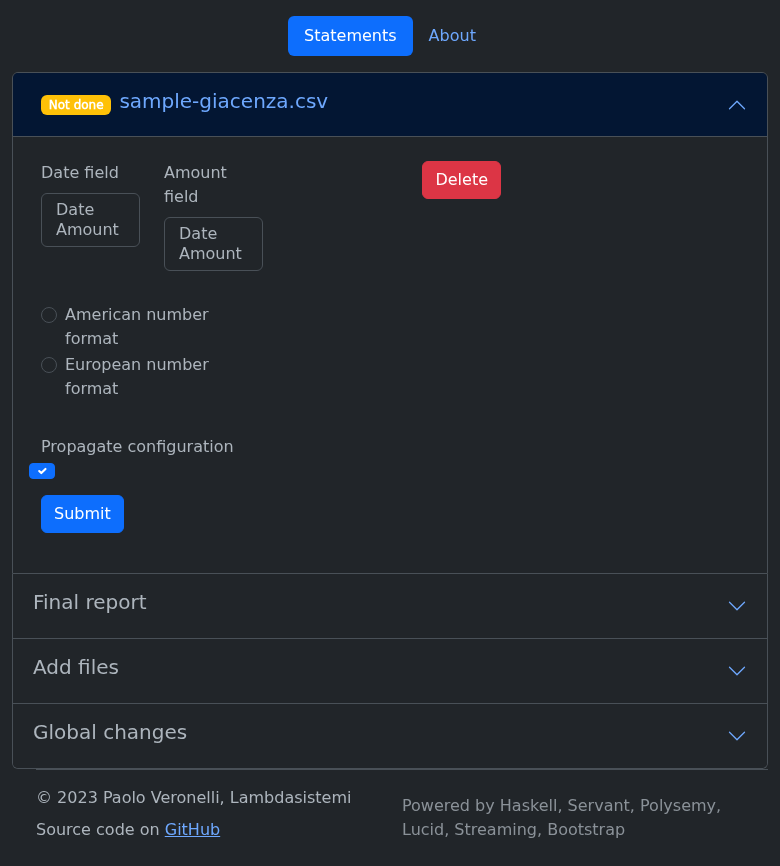

# Tutorial

A step-by-step guide to computing giacenza media and saldo with the app.

## 1. Upload CSV files

Click **Add file** and select one or more CSV files containing your bank
transactions. Each file must have a header row with date and amount columns.

## 2. Configure columns and number format

After uploading, configure:

- **Date column** — the header name of the date field
- **Amount column** — the header name of the amount field
- **Decimal separator** — dot (`.`) or comma (`,`)

These settings propagate to all uploaded files that share the same format.

## 3. View results

The results table shows the **giacenza media** and **saldo** for each year found
in your data.

When multiple files are uploaded, a **final report** row aggregates the totals
across all files.

